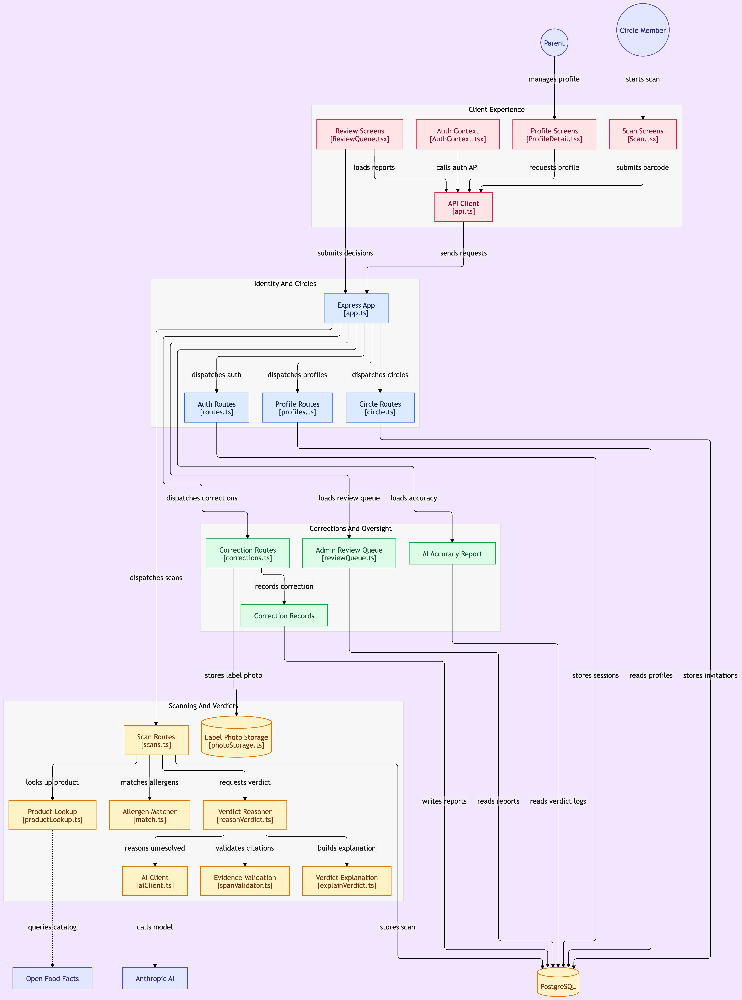

# Architecture

A container-level view of CircleBite as built: who uses it, which modules do the work, and where
data crosses a boundary. It is a reading aid for the rest of `docs/` — `verdict-engine.md` for how
a scan becomes a verdict, `principles.md` for why the safety-relevant calls were made the way they
were, `server-setup.md` for what runs on the box.

## What the picture is saying

Four groupings, matching how the code is organized rather than how a user moves through it:

- **Client Experience** — React screens, all of them reaching the server through one API client
  (`client/src/lib/api.ts`). No screen talks to the server any other way.
- **Identity And Circles** — the Express app and the routers that own accounts, profiles, and the
  circle (co-managers and followers, with share levels).
- **Scanning And Verdicts** — the path a barcode takes: product lookup, the deterministic allergen
  matcher, then the AI reasoning path for what the matcher couldn't resolve, with span validation
  on every citation and a stored explanation for every verdict.
- **Corrections And Oversight** — the overrule loop. Reports from circle members, the corroboration
  rules that decide whether a report changes what anyone else sees, the admin review queue that can
  reject one, and the AI accuracy page.

Two external dependencies, both read-only from the app's side: Open Food Facts for product data,
and the Anthropic API for the reasoning path. Everything else — Postgres, the label photos, the
session store — runs on the project's own instance, per `CONTEST_RULES.md` R6.

## Caveats

- **A snapshot, not generated output.** Dated 2026-09-20, at the point the review queue shipped.
  Nothing regenerates it, so treat it as a map rather than a source of truth, and check it against
  the code before relying on a detail.
- One known inaccuracy: the diagram shows the review screen submitting decisions straight to the
  Express app. It doesn't — like every other screen, it goes through `api.ts`. Fix on the next pass.
